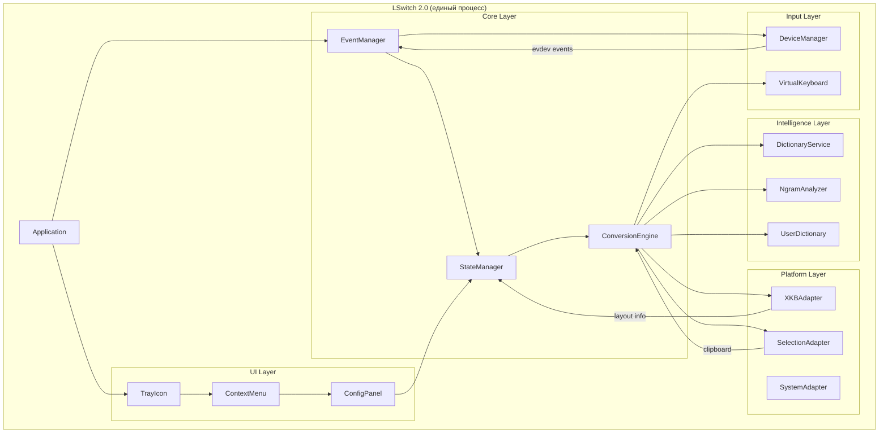
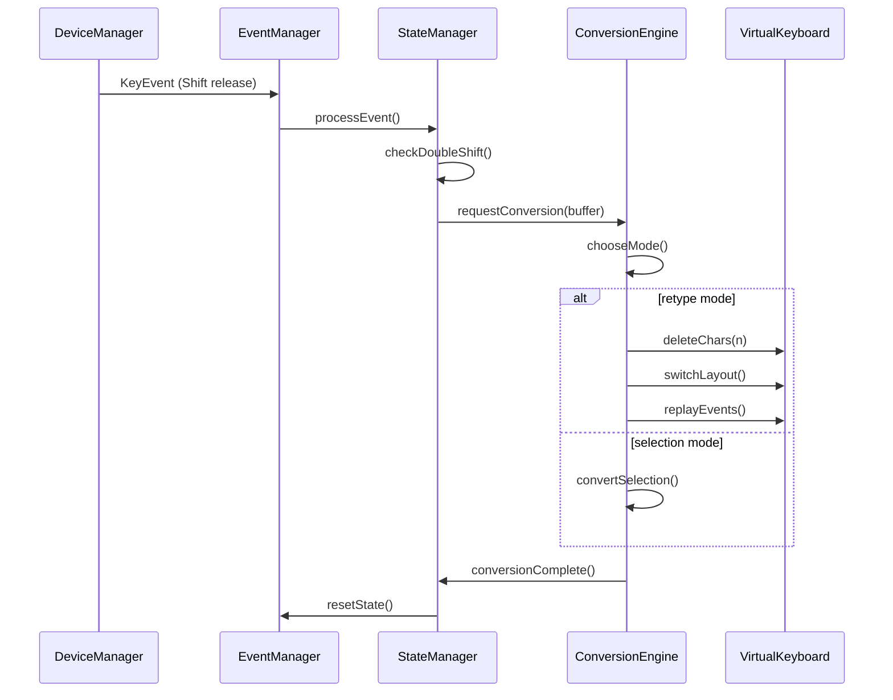
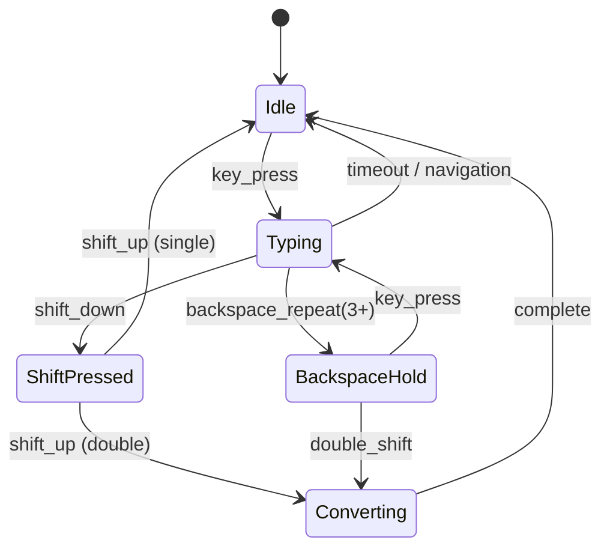
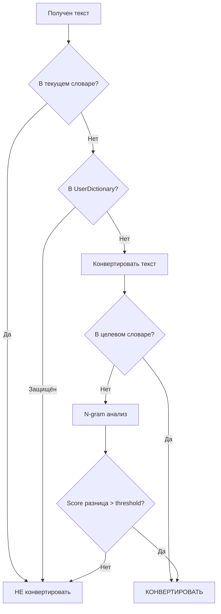
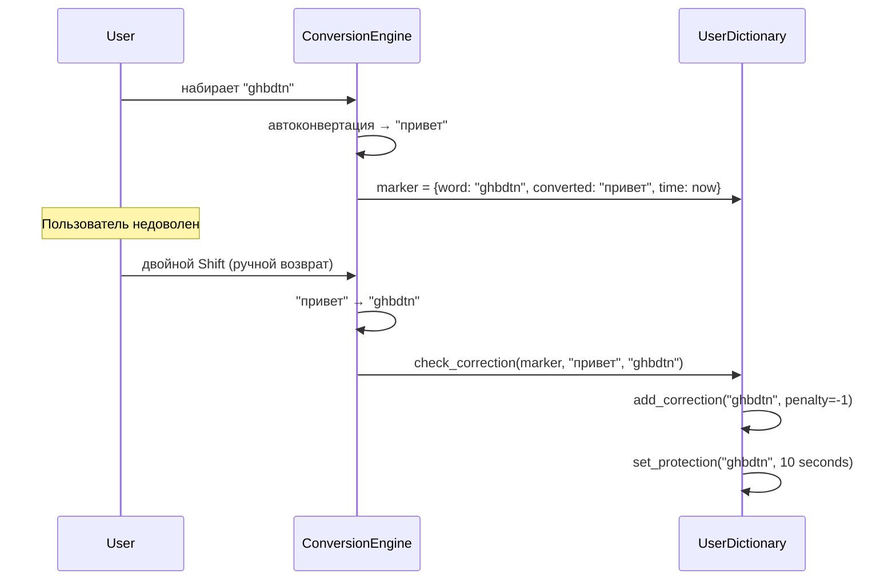
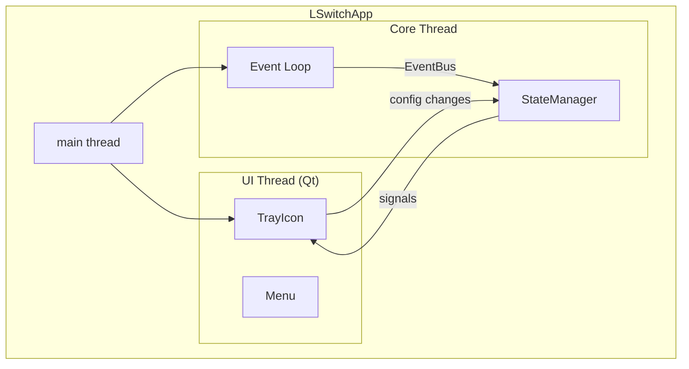

# Техническое задание LSwitch 2.0

## 1. Введение и цели

### 1.1 О проекте
LSwitch — переключатель раскладки клавиатуры для Linux (X11) с автоматической конвертацией текста между раскладками EN↔RU при двойном нажатии Shift.

### 1.2 Цели версии 2.0
1. **Объединить службу и GUI** — единый процесс вместо раздельных daemon/control panel
2. **Упростить архитектуру** — чёткое разделение ответственности, меньше кода
3. **Улучшить тестируемость** — модульность и DI для изолированного тестирования
4. **Устранить известные баги** — race conditions, проблемы свежести выделения, залипание флагов
5. **Повысить надёжность** — атомарные операции, предсказуемое поведение

### 1.3 Область применения
- Операционная система: Linux (X11, частичная поддержка Wayland через XWayland)
- Окружения рабочего стола: Cinnamon, KDE Plasma, GNOME (с X11)
- Раскладки: EN/RU (QWERTY ↔ ЙЦУКЕН), расширяемо для других пар

---

## 2. Анализ проблем текущей версии

### 2.1 Критические проблемы

| # | Проблема | Файл | Суть |
|---|----------|------|------|
| 1 | **Раздельные процессы GUI/daemon** | `lswitch_control.py`, `lswitch/core.py` | Синхронизация через файлы → гонки, несогласованность конфигов |
| 2 | **Монолитный класс LSwitch** | `lswitch/core.py` (1640 строк) | Один класс делает всё: события, конвертация, буферы, XKB |
| 3 | **Неопределённая свежесть выделения** | `core.py:892-903` | Повторное выделение того же текста считается "устаревшим" |
| 4 | **Залипание backspace_hold флага** | `input.py:266-305` | Флаг не сбрасывается при новом вводе |
| 5 | **Дублирование логики** | `core.py`, `input.py` | `handle_event` есть в обоих, пути пересекаются |

### 2.2 Проблемы среднего приоритета

| # | Проблема | Суть |
|---|----------|------|
| 6 | Неатомарная запись файла раскладок | Частичный JSON может не распарситься |
| 7 | Несогласованные пути конфигов | Daemon смотрит `/etc/lswitch`, GUI пишет `~/.config/lswitch` |
| 8 | Сложная логика выбора режима | retype vs selection определяется множеством условий |
| 9 | Отсутствие централизованной машины состояний | Флаги разбросаны по классам |

### 2.3 Что работает хорошо (сохранить)

- **Карты конвертации** `EN_TO_RU`, `RU_TO_EN` — полные, проверенные
- **N-gram анализ** — качественные данные биграмм/триграмм
- **UserDictionary** — самообучение с симметричными весами
- **DeviceManager** — hot-plug через udev
- **ISystem интерфейс** — хороший паттерн для DI
- **XKB интеграция** — прямой вызов libX11

---

## 3. Архитектура LSwitch 2.0

### 3.1 Обзор архитектуры



### 3.2 Слои архитектуры

| Слой | Ответственность | Зависимости |
|------|----------------|-------------|
| **UI Layer** | Tray icon, меню, настройки | Core Layer |
| **Core Layer** | Бизнес-логика, состояния, конвертация | Input, Platform, Intelligence |
| **Input Layer** | Устройства ввода, виртуальная клавиатура | Platform Layer |
| **Platform Layer** | X11/XKB, clipboard, системные вызовы | Нет (изолирован) |
| **Intelligence Layer** | Словари, N-граммы, самообучение | Нет (изолирован) |

### 3.3 Потоки данных



---

## 4. Описание основных модулей

### 4.1 Application (точка входа)

```
lswitch/
├── __main__.py          # python -m lswitch
├── app.py               # class LSwitchApp — главный класс приложения
└── cli.py               # Парсинг аргументов командной строки
```

**LSwitchApp** — единая точка входа:
- Инициализирует все компоненты
- Управляет жизненным циклом
- Объединяет service и GUI в одном процессе
- Предоставляет режимы: `--headless` (без GUI), `--tray` (с tray icon)

### 4.2 Core Layer

#### 4.2.1 EventManager
```
lswitch/core/
├── event_manager.py     # class EventManager
├── events.py            # Типы событий (dataclasses)
└── event_bus.py         # Pub/sub для внутренней коммуникации
```

**Ответственность:**
- Получает raw events от DeviceManager
- Классифицирует события (обычная клавиша, Shift, Backspace, навигация)
- Публикует типизированные события в EventBus
- НЕ содержит бизнес-логику (только маршрутизация)

#### 4.2.2 StateManager
```
lswitch/core/
├── state_manager.py     # class StateManager
├── states.py            # Enum состояний + dataclass контекста
└── transitions.py       # Правила переходов между состояниями
```

**Состояния системы:**


**Контекст состояния:**
- `buffer: InputBuffer` — текущий ввод
- `last_shift_time: float` — время последнего Shift
- `backspace_hold: bool` — удержание Backspace
- `selection_owner: int` — ID владельца выделения
- `current_layout: str` — текущая раскладка

#### 4.2.3 ConversionEngine
```
lswitch/core/
├── conversion_engine.py  # class ConversionEngine
├── modes.py              # RetypeMode, SelectionMode
└── text_converter.py     # Статические функции конвертации текста
```

**Ответственность:**
- Выбор режима конвертации (retype/selection)
- Выполнение конвертации текста
- Координация с VirtualKeyboard и SelectionAdapter
- Обучение UserDictionary

### 4.3 Input Layer

#### 4.3.1 DeviceManager
```
lswitch/input/
├── device_manager.py    # class DeviceManager (сохраняем текущий)
├── device_filter.py     # Фильтрация устройств
└── udev_monitor.py      # Hot-plug мониторинг
```

Сохраняем текущую реализацию — она работает хорошо.

#### 4.3.2 VirtualKeyboard
```
lswitch/input/
├── virtual_keyboard.py  # class VirtualKeyboard
└── key_mapper.py        # keycode ↔ char маппинг
```

**Ответственность:**
- Создание/управление UInput устройством
- tap_key, replay_events
- Синхронизация раскладок с системой

### 4.4 Platform Layer

#### 4.4.1 XKBAdapter
```
lswitch/platform/
├── xkb_adapter.py       # class XKBAdapter
├── xkb_bindings.py      # ctypes биндинги к libX11
└── layout_info.py       # dataclass LayoutInfo
```

**Ответственность:**
- Получение списка раскладок
- Определение текущей раскладки
- Переключение раскладки через XkbLockGroup
- keycode → char через XkbKeycodeToKeysym

#### 4.4.2 SelectionAdapter
```
lswitch/platform/
├── selection_adapter.py # class SelectionAdapter
└── clipboard.py         # Clipboard operations
```

**Ответственность:**
- Чтение/запись PRIMARY selection
- Чтение/запись CLIPBOARD
- Получение selection owner ID
- Атомарная замена выделенного текста

#### 4.4.3 SystemAdapter
```
lswitch/platform/
├── system_adapter.py    # class SystemAdapter (ISystem interface)
└── subprocess_impl.py   # SubprocessSystem реализация
```

Сохраняем текущий ISystem интерфейс — хороший паттерн для DI.

### 4.5 Intelligence Layer

#### 4.5.1 DictionaryService
```
lswitch/intelligence/
├── dictionary_service.py # class DictionaryService
├── ru_words.py           # RUSSIAN_WORDS set
├── en_words.py           # ENGLISH_WORDS set
└── converted_words.py    # Предвычисленные конверсии
```

#### 4.5.2 NgramAnalyzer
```
lswitch/intelligence/
├── ngram_analyzer.py    # class NgramAnalyzer
├── bigrams.py           # BIGRAMS_RU, BIGRAMS_EN
└── trigrams.py          # TRIGRAMS_RU, TRIGRAMS_EN
```

#### 4.5.3 UserDictionary
```
lswitch/intelligence/
├── user_dictionary.py   # class UserDictionary (сохраняем логику)
└── persistence.py       # Атомарное сохранение JSON
```

### 4.6 UI Layer

```
lswitch/ui/
├── tray_icon.py         # class TrayIcon
├── context_menu.py      # class ContextMenu
├── config_dialog.py     # class ConfigDialog
└── adapters/
    ├── base.py          # BaseUIAdapter
    ├── cinnamon.py      # CinnamonAdapter (CustomMenu)
    └── kde.py           # KDEAdapter (native QMenu)
```

**Ключевое изменение:** UI напрямую работает с StateManager, не через файлы.

---

## 5. Интерфейсы и протоколы взаимодействия

### 5.1 Интерфейс ISystemAdapter

```python
from abc import ABC, abstractmethod
from dataclasses import dataclass
from typing import Optional

@dataclass
class CommandResult:
    stdout: str
    stderr: str
    returncode: int

class ISystemAdapter(ABC):
    @abstractmethod
    def run_command(self, args: list[str], timeout: float = 1.0) -> CommandResult: ...
    
    @abstractmethod
    def xdotool_key(self, sequence: str, timeout: float = 0.3) -> None: ...
    
    @abstractmethod
    def get_clipboard(self, selection: str = 'primary') -> str: ...
    
    @abstractmethod
    def set_clipboard(self, text: str, selection: str = 'clipboard') -> None: ...
```

### 5.2 Интерфейс IXKBAdapter

```python
from abc import ABC, abstractmethod
from dataclasses import dataclass

@dataclass
class LayoutInfo:
    name: str          # 'en', 'ru'
    index: int         # 0, 1
    xkb_name: str      # 'us', 'ru'

class IXKBAdapter(ABC):
    @abstractmethod
    def get_layouts(self) -> list[LayoutInfo]: ...
    
    @abstractmethod
    def get_current_layout(self) -> LayoutInfo: ...
    
    @abstractmethod
    def switch_layout(self, target: Optional[LayoutInfo] = None) -> LayoutInfo: ...
    
    @abstractmethod
    def keycode_to_char(self, keycode: int, layout: LayoutInfo, shift: bool = False) -> str: ...
```

### 5.3 Интерфейс ISelectionAdapter

```python
from abc import ABC, abstractmethod
from dataclasses import dataclass
from typing import Optional

@dataclass
class SelectionInfo:
    text: str
    owner_id: int
    timestamp: float

class ISelectionAdapter(ABC):
    @abstractmethod
    def get_selection(self) -> SelectionInfo: ...
    
    @abstractmethod
    def has_fresh_selection(self, threshold: float = 0.5) -> bool: ...
    
    @abstractmethod
    def replace_selection(self, new_text: str) -> bool: ...
    
    @abstractmethod
    def expand_selection_to_word(self) -> SelectionInfo: ...
```

### 5.4 EventBus (внутренняя коммуникация)

```python
from dataclasses import dataclass
from typing import Callable, Any
from enum import Enum, auto

class EventType(Enum):
    KEY_PRESS = auto()
    KEY_RELEASE = auto()
    DOUBLE_SHIFT = auto()
    CONVERSION_START = auto()
    CONVERSION_COMPLETE = auto()
    LAYOUT_CHANGED = auto()
    CONFIG_CHANGED = auto()

@dataclass
class Event:
    type: EventType
    data: Any
    timestamp: float

class EventBus:
    def subscribe(self, event_type: EventType, handler: Callable[[Event], None]) -> None: ...
    def publish(self, event: Event) -> None: ...
    def unsubscribe(self, event_type: EventType, handler: Callable) -> None: ...
```

---

## 6. Словари и алгоритмы конвертации

### 6.1 Алгоритм определения необходимости конвертации



### 6.2 Приоритеты принятия решения

1. **Приоритет 1:** Слово в словаре текущей раскладки → НЕ трогать
2. **Приоритет 1.5:** Слово защищено в UserDictionary → НЕ трогать
3. **Приоритет 2:** Конвертированное слово в словаре целевой раскладки → КОНВЕРТИРОВАТЬ
4. **Приоритет 3:** N-gram анализ даёт значительную разницу → КОНВЕРТИРОВАТЬ
5. **Приоритет 4:** Спецсимволы в тексте (пароли) → НЕ трогать

### 6.3 Формула N-gram score

```
score = Σ(trigram_weight × 3) + Σ(bigram_weight × 1) + Σ(forbidden_penalty)
normalized_score = score / len(text_without_special_chars)
```

### 6.4 UserDictionary: симметричные веса

```
weight > 0  →  правильная форма = EN
weight < 0  →  правильная форма = RU
weight = 0  →  удалить запись

Автоконвертация активируется при |weight| >= threshold (default: 5)
```

### 6.5 Механизм коррекции



---

## 7. Система событий и состояний

### 7.1 Машина состояний

```python
from enum import Enum, auto
from dataclasses import dataclass, field
from typing import Optional
import time

class State(Enum):
    IDLE = auto()
    TYPING = auto()
    SHIFT_PRESSED = auto()
    CONVERTING = auto()
    BACKSPACE_HOLD = auto()

@dataclass
class StateContext:
    state: State = State.IDLE
    buffer: list = field(default_factory=list)
    event_buffer: list = field(default_factory=list)
    last_shift_time: float = 0.0
    shift_pressed: bool = False
    backspace_repeats: int = 0
    selection_owner_id: int = 0
    current_layout: str = 'en'
    
    def reset(self):
        self.buffer.clear()
        self.event_buffer.clear()
        self.last_shift_time = 0.0
        self.shift_pressed = False
        self.backspace_repeats = 0
```

### 7.2 Переходы состояний

| Из состояния | Событие | В состояние | Действие |
|--------------|---------|-------------|----------|
| IDLE | key_press | TYPING | добавить в буфер |
| TYPING | shift_down | SHIFT_PRESSED | запомнить время |
| SHIFT_PRESSED | shift_up (< timeout) | CONVERTING | запустить конвертацию |
| SHIFT_PRESSED | shift_up (>= timeout) | TYPING | обновить last_shift_time |
| TYPING | backspace_repeat(3+) | BACKSPACE_HOLD | установить флаг |
| BACKSPACE_HOLD | key_press (не backspace) | TYPING | сбросить флаг |
| CONVERTING | complete | IDLE | сбросить контекст |
| ANY | navigation_key | IDLE | очистить буфер |
| ANY | mouse_click | IDLE | очистить буфер |

### 7.3 Определение свежести выделения (ИСПРАВЛЕНИЕ БАГА)

**Проблема текущей версии:** сравнение только текста → повторное выделение того же текста = "несвежее"

**Решение v2.0:**
```python
@dataclass
class SelectionInfo:
    text: str
    owner_id: int      # XGetSelectionOwner
    timestamp: float   # Время получения

def has_fresh_selection(self, threshold: float = 0.5) -> bool:
    current = self._get_selection_info()
    
    # Критерий 1: owner изменился
    owner_changed = current.owner_id != self._last_selection.owner_id
    
    # Критерий 2: текст изменился
    text_changed = current.text != self._last_selection.text
    
    # Критерий 3: недавнее событие мыши/навигации
    recent_cursor_move = (time.time() - self._cursor_moved_at) < threshold
    
    is_fresh = owner_changed or text_changed or recent_cursor_move
    
    if is_fresh:
        self._last_selection = current
    
    return is_fresh and bool(current.text)
```

### 7.4 Сброс backspace_hold флага (ИСПРАВЛЕНИЕ БАГА)

**Проблема:** флаг не сбрасывается при новом вводе

**Решение v2.0:**
```python
def on_key_press(self, keycode: int):
    # Любая клавиша кроме Backspace сбрасывает hold
    if keycode != KEY_BACKSPACE:
        if self.context.backspace_repeats > 0:
            self.context.backspace_repeats = 0
        # Сбрасываем hold только если прошло достаточно времени
        if self._backspace_hold_at and (time.time() - self._backspace_hold_at) > 0.3:
            self.context.state = State.TYPING
            self._backspace_hold_at = 0.0
```

---

## 8. Объединение службы и GUI

### 8.1 Режимы запуска

```bash
# С tray icon (по умолчанию)
lswitch

# Без GUI (headless daemon)
lswitch --headless

# Только GUI (управление внешним daemon)
lswitch --control-only

# Debug режим
lswitch --debug
```

### 8.2 Архитектура единого процесса



### 8.3 Синхронизация UI ↔ Core

**Текущая проблема:** GUI пишет в файл, daemon читает → race conditions

**Решение v2.0:** прямая коммуникация через EventBus

```python
class LSwitchApp:
    def __init__(self):
        self.event_bus = EventBus()
        self.config = ConfigManager()
        
        # Core подписывается на изменения конфига
        self.event_bus.subscribe(EventType.CONFIG_CHANGED, self._on_config_changed)
        
        # UI публикует изменения напрямую
        self.tray.config_changed.connect(
            lambda key, val: self.event_bus.publish(
                Event(EventType.CONFIG_CHANGED, {'key': key, 'value': val}, time.time())
            )
        )
    
    def _on_config_changed(self, event: Event):
        key, value = event.data['key'], event.data['value']
        self.config.set(key, value)
        # Применяем изменение немедленно
        if key == 'auto_switch':
            self.state_manager.auto_switch_enabled = value
```

### 8.4 Конфигурация

**Единый путь:** `~/.config/lswitch/config.json`

**Атомарная запись:**
```python
def save_config(self, config: dict):
    import tempfile
    import os
    
    config_path = os.path.expanduser('~/.config/lswitch/config.json')
    dir_path = os.path.dirname(config_path)
    
    # Пишем во временный файл
    fd, tmp_path = tempfile.mkstemp(dir=dir_path, suffix='.json')
    try:
        with os.fdopen(fd, 'w') as f:
            json.dump(config, f, indent=2, ensure_ascii=False)
        # Атомарная замена
        os.replace(tmp_path, config_path)
    except:
        os.unlink(tmp_path)
        raise
```

---

## 9. План тестирования

### 9.1 Unit тесты

| Модуль | Тестируемый функционал |
|--------|----------------------|
| `StateManager` | Переходы состояний, таймауты |
| `ConversionEngine` | Выбор режима, конвертация текста |
| `NgramAnalyzer` | Score вычисление, should_convert |
| `UserDictionary` | Веса, защита, коррекции |
| `SelectionAdapter` | has_fresh_selection с owner_id |

### 9.2 Integration тесты

| Сценарий | Описание |
|----------|----------|
| `test_double_shift_retype` | Двойной Shift → конвертация через retype |
| `test_double_shift_selection` | Двойной Shift при выделении → конвертация selection |
| `test_backspace_hold_selection` | Удержание Backspace → selection mode |
| `test_same_text_reselection` | Повторное выделение того же текста |
| `test_auto_convert_learning` | Автоконвертация + коррекция + обучение |
| `test_config_change_immediate` | Изменение конфига → немедленное применение |

### 9.3 Regression тесты (из аудит-отчёта)

1. GUI переключает `auto_switch` → daemon применяет за < 2 секунды
2. Двойное выделение одного текста мышью → конвертируется оба раза
3. Backspace hold → новый ввод → двойной Shift → retype mode (не selection)
4. Быстрая публикация раскладок → стабильный парсинг JSON

### 9.4 Mock-объекты для тестирования

```python
class MockXKBAdapter(IXKBAdapter):
    def __init__(self, layouts: list[str] = ['en', 'ru']):
        self._layouts = [LayoutInfo(l, i, l) for i, l in enumerate(layouts)]
        self._current_index = 0
    
    def get_layouts(self) -> list[LayoutInfo]:
        return self._layouts
    
    def get_current_layout(self) -> LayoutInfo:
        return self._layouts[self._current_index]
    
    def switch_layout(self, target=None) -> LayoutInfo:
        if target:
            self._current_index = target.index
        else:
            self._current_index = (self._current_index + 1) % len(self._layouts)
        return self._layouts[self._current_index]

class MockSelectionAdapter(ISelectionAdapter):
    def __init__(self):
        self._selection = SelectionInfo('', 0, 0)
        self._owner_counter = 0
    
    def set_selection(self, text: str):
        self._owner_counter += 1
        self._selection = SelectionInfo(text, self._owner_counter, time.time())
    
    def get_selection(self) -> SelectionInfo:
        return self._selection
    
    def has_fresh_selection(self, threshold: float = 0.5) -> bool:
        return bool(self._selection.text) and (time.time() - self._selection.timestamp) < threshold
```

---

## 10. Принятые решения

### 10.1 Объединение процессов vs IPC

**Вопрос:** Объединять ли daemon и GUI в один процесс или использовать IPC (D-Bus, сокеты)?

**Решение:** Объединить в один процесс.

**Обоснование:**
- Упрощает архитектуру — нет необходимости в протоколе IPC
- Устраняет race conditions при синхронизации конфига
- Уменьшает потребление ресурсов (один процесс вместо двух)
- PyQt5 поддерживает многопоточность — UI и event loop могут работать параллельно
- Режим `--headless` покрывает кейсы, где GUI не нужен

### 10.2 EventBus vs Callbacks

**Вопрос:** Как организовать коммуникацию между компонентами?

**Решение:** EventBus с типизированными событиями.

**Обоснование:**
- Ослабляет связанность между компонентами
- Упрощает тестирование — можно подписаться и проверить события
- Масштабируемо — легко добавить новые типы событий
- Альтернатива (прямые callbacks) создаёт циклические зависимости

### 10.3 Owner ID для свежести выделения

**Вопрос:** Как определять "свежесть" выделения при повторном выделении того же текста?

**Решение:** Использовать XGetSelectionOwner() + текст + timestamp.

**Обоснование:**
- Owner ID меняется при каждом новом выделении (даже того же текста)
- Комбинация трёх факторов даёт надёжное определение
- Решает баг из аудит-отчёта (п.3)

### 10.4 Сброс backspace_hold

**Вопрос:** Когда сбрасывать флаг удержания Backspace?

**Решение:** При первом нажатии любой клавиши (кроме Backspace) И если прошло > 0.3с с момента hold.

**Обоснование:**
- Немедленный сброс может потерять намерение пользователя
- Задержка 0.3с даёт время для "отпустить Backspace + сразу Shift"
- Решает баг из аудит-отчёта (п.4)

### 10.5 Атомарная запись файлов

**Вопрос:** Как избежать частичного чтения при записи конфигов?

**Решение:** write → tmp file + os.replace()

**Обоснование:**
- `os.replace()` атомарен на POSIX системах
- Временный файл в той же директории гарантирует работу `replace`
- Решает баг из аудит-отчёта (п.6)

### 10.6 Структура пакета

**Вопрос:** Как организовать модули в packages?

**Решение:** Группировка по слоям (core/, input/, platform/, intelligence/, ui/)

**Обоснование:**
- Чётко видны зависимости между слоями
- Упрощает навигацию по коду
- Соответствует диаграмме архитектуры

---

## Приложение A: Карты конвертации

Сохраняем текущие карты из `conversion_maps.py`:

```python
EN_TO_RU = {
    'q': 'й', 'w': 'ц', 'e': 'у', 'r': 'к', 't': 'е', 'y': 'н', 'u': 'г', 'i': 'ш', 
    'o': 'щ', 'p': 'з', '[': 'х', ']': 'ъ', 'a': 'ф', 's': 'ы', 'd': 'в', 'f': 'а',
    'g': 'п', 'h': 'р', 'j': 'о', 'k': 'л', 'l': 'д', ';': 'ж', "'": 'э', 'z': 'я',
    'x': 'ч', 'c': 'с', 'v': 'м', 'b': 'и', 'n': 'т', 'm': 'ь', ',': 'б', '.': 'ю',
    '/': '.', '`': 'ё',
    # uppercase...
}

RU_TO_EN = {v: k for k, v in EN_TO_RU.items()}
```

---

## Приложение B: Миграция с v1

### Совместимость конфигов
- Путь `~/.config/lswitch/config.json` — сохраняется
- Все текущие ключи конфига — поддерживаются
- `user_dict.json` — полностью совместим

### Удаляемые компоненты
- `/etc/lswitch/` — глобальный конфиг (не использовался)
- `$XDG_RUNTIME_DIR/lswitch_layouts.json` — синхронизация раскладок (не нужна)
- Отдельный `lswitch-control` entry point — объединён в `lswitch`

### Новые опции CLI
```bash
lswitch --headless    # Режим без GUI
lswitch --debug       # Debug вывод
lswitch --version     # Версия
```

---

*Документ подготовлен: 24 февраля 2026*
*Версия ТЗ: 2.0.0-draft*
